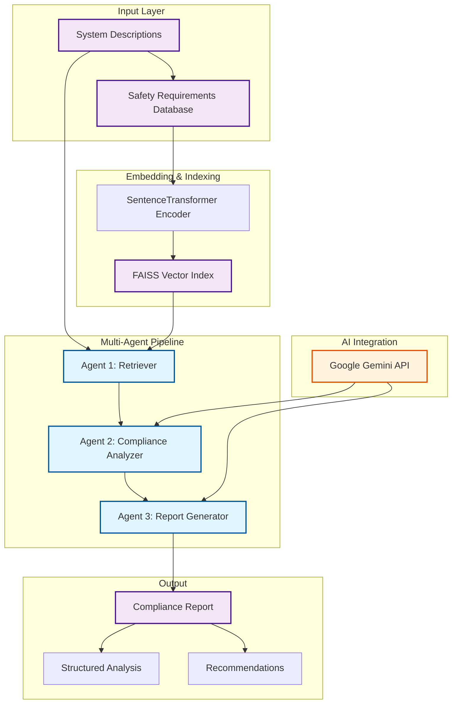
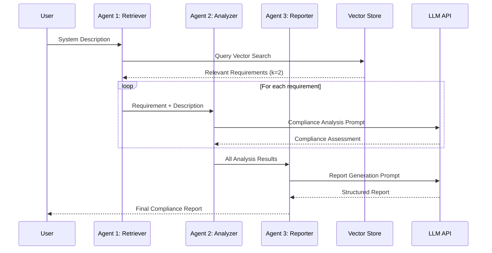

# 🛡️ Automated Safety Requirement Analysis using RAG & Generative AI

[](https://python.org)
[](LICENSE)
[](https://ai.google.dev/)

This project implements an intelligent safety compliance analysis system using **Retrieval-Augmented Generation (RAG)** and **multi-agent architecture**. The system automatically evaluates safety-critical system descriptions against predefined safety requirements, leveraging Google Gemini AI, FAISS vector search, and semantic embeddings for automated compliance verification.

## 🏗️ System Architecture



## 🧠 Technical Overview

### Core Components

| Component | Technology | Purpose |
|-----------|------------|---------|
| **Embedding Engine** | sentence-transformers (MiniLM-L6-v2) | Convert text to high-dimensional vectors |
| **Vector Store** | FAISS (Facebook AI Similarity Search) | Fast similarity search and retrieval |
| **LLM Integration** | Google Gemini 2.0 Flash | Natural language analysis and generation |
| **Multi-Agent System** | Custom Python Architecture | Orchestrated pipeline execution |

### Agent Architecture



## 📂 Project Structure

```
Safety_Analysis/
├── safety_analysis/
│   ├── main.py                 # Main pipeline orchestrator
│   ├── config.py              # Configuration and API keys
│   ├── dummy_data.py          # Sample safety requirements and descriptions
│   ├── system_descriptions.csv # Test dataset
│   └── requirements.txt       # Python dependencies
├── README.md                  # Project documentation
├── .gitignore                # Git ignore rules
└── .venv/                    # Virtual environment
```

## 🔧 Technical Implementation

### 1. Vector Embedding Pipeline
```python
# Semantic embedding generation
embedder = SentenceTransformer("all-MiniLM-L6-v2")
requirement_embeddings = embedder.encode(safety_requirements)

# FAISS index creation for fast similarity search
dimension = requirement_embeddings.shape[1]  # 384 dimensions
index = faiss.IndexFlatL2(dimension)
index.add(requirement_embeddings)
```

### 2. Multi-Agent Workflow
- **Agent 1 (Retriever)**: Performs semantic similarity search using cosine distance
- **Agent 2 (Analyzer)**: Conducts compliance analysis using structured prompts
- **Agent 3 (Reporter)**: Generates comprehensive reports with recommendations

### 3. LLM Integration
```python
# Gemini API configuration
genai.configure(api_key=GEMINI_API_KEY)
llm = genai.GenerativeModel("gemini-2.0-flash")
```

## 🚀 Quick Start

### Prerequisites
- Python 3.8+
- Google Gemini API key
- Virtual environment (recommended)

### Installation

1. **Clone the repository**
   ```bash
   git clone https://github.com/Virendra2499/Safety-AnalysisMultiAgent.git
   cd Safety_Analysis
   ```

2. **Set up virtual environment**
   ```bash
   python -m venv .venv
   source .venv/Scripts/activate  # Windows Git Bash
   # or
   .venv\Scripts\activate.bat     # Windows CMD
   ```

3. **Install dependencies**
   ```bash
   pip install -r requirements.txt
   ```

4. **Configure API key**
   ```python
   # config.py
   GEMINI_API_KEY = "your_gemini_api_key_here"
   ```

5. **Run the analysis**
   ```bash
   python main.py
   ```

## 🧪 Example Usage

### Input
```python
system_description = """
The PLC controls all safety interlocks. In case of mechanical 
failure or fault detection, it instantly disables motor drives 
via relay contactors.
"""
```

### Processing Flow
1. **Retrieval**: Finds most relevant safety requirements using vector similarity
2. **Analysis**: Evaluates compliance using structured LLM prompts
3. **Reporting**: Generates actionable recommendations

### Output
```
Requirement: The system shall cease motor operation if a fault is received from the safety PLC.

Compliance: ✅ COMPLIANT

Explanation: The system description clearly states that the PLC disables motor drives 
upon fault detection, satisfying the requirement.

Recommendation: Consider implementing redundant safety channels for critical applications.
```

## 🔐 Security & Configuration

### API Key Management
- Store API keys in `config.py` (excluded from version control)
- Use environment variables for production deployment
- Never commit sensitive credentials

### Environment Variables (Production)
```bash
export GEMINI_API_KEY="your_api_key"
export PYTHONPATH="${PYTHONPATH}:$(pwd)"
```

## 📊 Performance Metrics

| Metric | Value | Description |
|--------|-------|-------------|
| **Embedding Dimension** | 384 | MiniLM-L6-v2 vector size |
| **Search Complexity** | O(n) | FAISS flat index |
| **Average Response Time** | ~2-3s | Including LLM API calls |
| **Memory Usage** | ~100MB | Base model + embeddings |

## 🔬 Advanced Features

### Custom Safety Standards Integration
```python
# Support for ISO 26262, IEC 61508, etc.
SAFETY_STANDARDS = {
    "ISO_26262": "automotive_requirements.json",
    "IEC_61508": "industrial_requirements.json"
}
```

### Batch Processing
```python
def batch_analyze(descriptions_csv):
    """Process multiple system descriptions"""
    # Implementation for bulk analysis
    pass
```

## 🚧 Roadmap

- [ ] **Web Interface**: Streamlit/Flask dashboard
- [ ] **Document Upload**: PDF/DOCX parsing support
- [ ] **Export Formats**: PDF/PPTX report generation
- [ ] **Standards Integration**: ISO 26262, IEC 61508 compliance
- [ ] **Visualization**: Compliance dashboards and metrics
- [ ] **API Endpoints**: RESTful service architecture

## 🤝 Contributing

1. Fork the repository
2. Create a feature branch (`git checkout -b feature/amazing-feature`)
3. Commit changes (`git commit -m 'Add amazing feature'`)
4. Push to branch (`git push origin feature/amazing-feature`)
5. Open a Pull Request

## 📄 License

This project is licensed under the MIT License - see the [LICENSE](LICENSE) file for details.

## 🙏 Acknowledgments

- [sentence-transformers](https://www.sbert.net/) for semantic embeddings
- [FAISS](https://github.com/facebookresearch/faiss) for efficient similarity search
- [Google Gemini](https://ai.google.dev/) for advanced language understanding
- Safety engineering community for domain expertise

---

**🔍 Keywords**: Safety Analysis, RAG, Multi-Agent Systems, Compliance Automation, Vector Search, LLM Integration, Semantic Similarity, Industrial Safety, Automotive Safety
